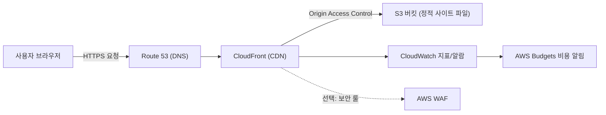

# AWS 소규모 웹사이트 아키텍처 (저비용 중심)

작성일: 2026-03-31  
목표: **소규모 웹사이트를 AWS에서 저렴하게 개설·운영**

## 1) 요구사항 요약

- 초기 방문자 수가 크지 않은 소규모 사이트
- 운영 자동화(배포 단순화), 관리 부담 최소화
- HTTPS 기본 적용
- 비용은 고정비를 낮추고 사용량 기반 과금 중심

## 2) 추천 아키텍처 (가장 저렴하고 단순한 기본안)

**정적 웹사이트 기준 기본안**

1. **Route 53**: 도메인 관리 및 DNS 라우팅
2. **CloudFront + ACM**: 전역 CDN/HTTPS(인증서 무료)
3. **S3 (정적 호스팅 원본)**: HTML/CSS/JS/이미지 저장
4. **CloudWatch + Budget**: 모니터링 및 비용 알림
5. (선택) **WAF**: 기본 보안 룰 적용 (트래픽/보안 요구 있을 때)

> 포인트: EC2/Lightsail 없이 시작하면 운영 복잡도와 고정비를 크게 줄일 수 있습니다.

---

## 3) 서비스별 역할

### Route 53
- 도메인 구매/연결
- `A/AAAA(별칭)` 레코드로 CloudFront 배포 연결

### CloudFront + ACM
- TLS 종료(HTTPS)
- 캐시로 응답 속도 향상 + S3 직접 노출 차단(OAC 권장)
- ACM 인증서는 **us-east-1**에 발급(CloudFront 연동 조건)

### S3
- 웹 정적 파일 저장소
- 버킷 퍼블릭 차단 유지 + CloudFront OAC로만 접근 허용
- 버전관리(Versioning) 켜두면 롤백에 유리

### CloudWatch + AWS Budgets
- CloudFront 4xx/5xx, 트래픽 지표 모니터링
- 월 비용 임계치(예: 5달러, 10달러) 알림 설정

### (선택) WAF
- 봇/악성 트래픽 차단
- 트래픽이 적고 공개 범위가 작다면 초기에 제외 가능

---

## 4) Mermaid 아키텍처 플로우

---

## 5) 운영 플로우 (배포)

1. 로컬에서 정적 파일 빌드/수정
2. S3 버킷에 업로드
3. 필요 시 CloudFront 캐시 무효화(Invalidation)
4. CloudWatch와 Budget 알림 확인

---

## 6) 비용 최적화 가이드

- **S3 + CloudFront 중심으로 시작** (서버 상시비용 회피)
- 이미지 최적화(WebP/AVIF)로 전송량 절감
- 캐시 정책 적절히 설정 (`Cache-Control`)으로 CloudFront 효율 극대화
- 로그 보관 주기 설정(장기 저장 최소화)
- 예산 알림을 낮은 구간부터 설정

---

## 7) 확장 시나리오 (트래픽 증가 시)

### 시나리오 A: 동적 기능 추가 필요
- **API Gateway + Lambda + DynamoDB** 추가
- 정적 프론트는 그대로 S3/CloudFront 유지

### 시나리오 B: CMS/서버 렌더링 필요
- 초기에는 Lightsail 또는 소형 EC2 1대로 시작
- 이후 ECS/Fargate 또는 EKS로 확장 검토

---

## 8) 최소 구성 체크리스트

- [ ] 도메인(Route 53) 연결
- [ ] ACM 인증서 발급(us-east-1)
- [ ] S3 버킷 생성(퍼블릭 차단 유지)
- [ ] CloudFront 배포 + OAC 연결
- [ ] DNS를 CloudFront로 연결
- [ ] Budgets/CloudWatch 알림 설정

이 문서는 **소규모/저비용 시작점**에 최적화되어 있으며, 필요 시 동적 아키텍처로 단계적 확장이 가능합니다.
